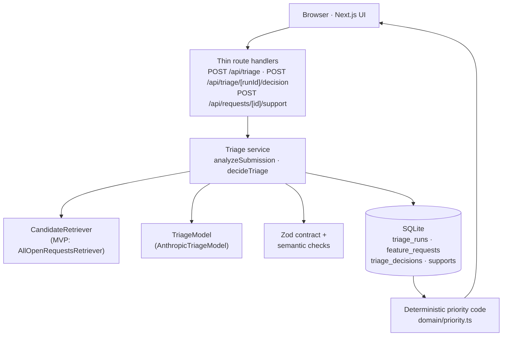

# Feature Intelligence

An AI-first feature-request triage system for **Acme Projects**, a fictional B2B project-management product.

When someone submits a request, the system doesn't just store it and wait for votes. It works out what the customer actually needs, checks whether someone has already asked for the same thing, and puts that recommendation in front of the person *before* anything is saved:

```
Submit request
  → AI analyzes the underlying need and compares it with existing requests
  → the application validates its structure and references
  → the person reviews it
  → the person decides: support an existing request, or create a new one
```

The AI changes the workflow itself — it intercepts probable duplicates at submission time — rather than decorating an ordinary voting board with generated text.

---

## Core capabilities

- **Submit** a feature request (title + description).
- **Browse** the backlog: search titles and descriptions, filter by theme, sort by priority, support count or recency. Filters live in the URL.
- **Support** existing requests (one support per browser).
- **Understand each request**: an AI-extracted problem statement, a theme from a fixed taxonomy, and a priority signal with every input shown.
- **Catch duplicates semantically**: the AI proposes probable duplicates and related requests, explaining the shared need and what differs.
- **Human review before consolidation**: a probable duplicate is never merged automatically; the submitter chooses.
- **Honest fallback**: if AI triage is unavailable, the request can still be submitted and is clearly marked *Not triaged*.
- **Inspectable rationale and decision criteria**: a `/how-it-works` page shows the exact taxonomy, strategy goals, rubric and formula the application uses.

## Why AI is used here

Duplicate detection in a feature backlog is a semantic problem. "Ping me in our team chat when someone hands work to me" and "Slack notifications when a task is assigned to me" use different words for the same need; "import tasks from CSV" and "export tasks to CSV" share keywords but don't. Extracting the underlying need, choosing a theme, spotting related requests and judging severity all require contextual interpretation that keyword matching can't provide.

The model is deliberately **bounded**:

- no tools and no database access;
- it cannot merge, create or modify requests;
- it does not output the final priority score or band.

> **The model supplies qualitative judgments. Application code validates and combines them. People make the consequential product decisions.**

The model's influence on priority is real and stated plainly: its severity, strategic-alignment and workaround-gap scores make up **70%** of the priority formula. What it does not do is compute the score, see demand, or act on its own recommendations.

---

## Architecture

A single Next.js 16 (App Router) application with SQLite (Drizzle ORM), Zod and the official Anthropic TypeScript SDK. Route handlers are thin; business logic lives in plain TypeScript modules.



Two interfaces are the production seams, and they evolve independently:

| Interface | MVP implementation | At scale |
|---|---|---|
| `CandidateRetriever` | Up to 50 existing requests (most supported first), each with a 500-character excerpt of the original description plus any AI problem statement and theme | Embedding / vector retrieval → top-K semantic shortlist |
| `TriageModel` | `AnthropicTriageModel` (structured output, no tools) | Any provider or model; the workflow depends only on the interface |

```
MVP:          bounded existing-request retrieval → LLM reasoning → human review
Future scale: embedding retrieval → top-K candidates → same LLM reasoning → same human review
```

## Analyze → Decide trust model

**Analyze** (`POST /api/triage`)

1. Validates the input (title 5–120 chars, description 20–2000).
2. Retrieves candidate requests.
3. Calls the configured model with a versioned prompt (`triage-v2`).
4. Schema-validates and sanitizes the output.
5. Persists an auditable **triage run**: input, input hash, candidate ids, model, prompt version, status, latency, every attempt's raw output and validation errors, and the validated output.
6. Returns a review model to the UI. **No feature request is created.**

**Decide** (`POST /api/triage/[runId]/decision`)

- Acts only on the **server-stored** input and validated output of the run.
- Rejects the decision if the text in the browser no longer hashes to the analyzed text (`stale_analysis`); editing after Analyze also resets the UI.
- Offers the actions the analysis allows:
  - **Support existing request** — only for a probable duplicate *this run proposed*;
  - **Create request** — when there is no probable duplicate;
  - **Create as new anyway** — an explicit override when there is one.
- When a probable duplicate was proposed, records the human decision (`supported_existing` or `created_new`) together with the AI's suggestion and confidence.

The browser can never supply enrichment, scores, candidate ids or a trusted duplicate target; extra fields are stripped and ignored. The database enforces **one request per triage run** and **one decision per triage run**, so replays and double clicks are idempotent. Each multi-row action (request + decision + support, or support + decision) is a single transaction.

## AI contract and safety boundaries

The model returns structured JSON:

| Field | Notes |
|---|---|
| `problemStatement` | The underlying need, not the proposed solution |
| `theme` + `themeRationale` | One of 9 fixed themes |
| `matches` (≤ 3) | Existing request id, `duplicate` / `related`, confidence `high` / `medium` / `low`, shared need, differences |
| `severity` | Score 1–5 + rationale |
| `strategicAlignment` | Score 1–5 + rationale + the strategy goal ids it advances |
| `workaroundGap` | Score 1–5 + rationale |

- **Constrained twice.** The provider's structured-output mode (`output_config.format` with a JSON Schema) constrains generation; the application validates again with Zod, plus semantic rules (e.g. an alignment score of 3–5 must cite at least one goal; a score of 1 must cite none).
- **References are checked.** Match ids not in the candidate set are removed and can never be acted upon. If a request appears twice, its strongest interpretation wins, so a "related" entry cannot hide a duplicate.
- **Only complete responses succeed.** Only an `end_turn` stop reason can produce an analysis; `max_tokens`, `model_context_window_exceeded` or any other reason is treated as incomplete. A refusal is a provider failure.
- **Bounded retries.** Invalid or incomplete output gets at most one corrective retry with concise validation feedback. If that retry fails after a usable first result, the usable result is kept. The SDK's own retries are disabled, so an Analyze makes at most two model calls.
- **No silent substitutes.** There is no fake-model fallback (an ESLint rule keeps test doubles out of application code) and no automatic fallback to another model. Each triage run records the exact model id the application requested. Seed data is labelled **Seed fixture**, never presented as live AI output.
- **What "AI-generated · format checked" means.** Structure, values and references were checked. The recommendation itself is AI judgment.

**Prompt injection.** Customer text — both the submission and existing requests — is treated as untrusted. It is serialized as JSON with `<`, `>` and `&` escaped so it cannot close the prompt's delimiter tags, and the prompt says to treat it only as customer content. This does **not** eliminate prompt injection. The real boundary is that the model has no consequential tools, its output is validated before use, and a person makes the decision.

## Duplicate semantics

| Relationship | Definition | Effect |
|---|---|---|
| **Duplicate** | Implementing one would substantially satisfy the underlying need expressed by the other | High/medium confidence → **probable duplicate**: a human decision is required before anything is created |
| **Related** | Same area or overlapping context, but meaningfully different product outcomes | Informational only; never blocks |
| Low-confidence duplicate | A plausible but weak connection | Informational only; never blocks |

Confidence is categorical (`high` / `medium` / `low`) rather than a fabricated numeric probability. The review shows the matched request (with its supporters and priority), the shared underlying need and what genuinely differs. If the submitter supports the existing request, their original wording is preserved and shown on that request as a *consolidated submission*.

## Priority signal

| Dimension | Weight | Source |
|---|---|---|
| Severity | 30% | AI score 1–5 |
| Strategic alignment | 20% | AI score 1–5, judged against the strategy goals below |
| Workaround gap | 20% | AI score 1–5 (5 = no reasonable workaround) |
| Observed demand | 30% | Computed from supports |

```
model score s ∈ 1..5      → (s − 1) / 4
observed demand (supports) → min(1, log2(1 + supports) / log2(21))     // full weight at 20 supports
priority = round(100 × Σ weight × normalized)                           // 0–100
bands: High ≥ 65 · Medium ≥ 40 · Low < 40
```

- The model never outputs the score or band; `domain/priority.ts` computes them from the latest support count whenever a request is read.
- A submitter is the first supporter of the request they create.
- Popularity and strategic value are separate signals by design: a popular low-severity request ("Dark mode", 18 supports) can rank *Medium*, while a strategic blocker can rank *High* with few supports.
- Priority is a transparent **signal for a product team**, not a roadmap decision.

**Acme Projects strategy goals** (the exact text the model receives):

1. Reduce manual status-chasing and coordination work.
2. Improve visibility and communication across teams.
3. Help teams automate repetitive project workflows.

## Failure behavior

| Situation | What happens |
|---|---|
| `ANTHROPIC_API_KEY` missing | Run recorded as `unavailable`; UI says AI triage is not configured |
| Provider error, timeout or refusal, with no earlier usable result | Run recorded as `provider_error`; no automatic retry |
| Invalid or incomplete output (e.g. `max_tokens`) after the one corrective retry, with no earlier usable result | Run recorded as `invalid_output` |
| Corrective retry fails (for any of the reasons above) after an earlier usable, sanitized result | The earlier result is kept and the run succeeds; any probable duplicate it found still requires a human decision |

When triage genuinely fails, no recommendation is invented. The person can still **Submit without triage**: the request is saved exactly as written, marked *Not triaged* and shown as *Unscored*. There is no re-triage feature.

---

## Evaluation and testing

### Unit tests

`npm test` (Vitest, 105 tests) verifies deterministic behavior and safety boundaries using a scripted fake model and an in-memory SQLite database. It never calls an external API. Representative coverage:

- priority computation, demand normalization and band boundaries;
- contract validation, semantic rules and match sanitization;
- the duplicate gate and the human decision paths;
- stale-analysis protection and ignored client-forged enrichment;
- idempotent supports, decisions and request creation;
- provider stop-reason, refusal and timeout handling (mocked SDK client);
- bounded retries, including keeping a usable first result;
- preserved wording for consolidated submissions;
- prompt delimiter integrity.

### Model evals

`npm run eval` probes the model's *judgment*, which is probabilistic, separately from the unit tests:

- uses the real configured Anthropic model and the full Analyze path, against an in-memory copy of the seeded backlog;
- runs a 10-case labeled dataset (`src/evals/triage-cases.ts`): semantic duplicates, related requests, new requests and two hard negatives that share keywords with existing requests;
- prints PASS/FAIL per case plus **case accuracy**, **duplicate precision** and **duplicate recall** (undefined metrics print as `n/a`);
- makes real, billed API calls (up to two per case) and is never part of `npm test`.

The latest local run with `claude-sonnet-5-5` scored 10/10, with duplicate precision 4/4 and recall 4/4. That is one small, hand-written smoke evaluation — not a statistically meaningful benchmark or a guarantee.

## Success metrics (if deployed)

1. **Median manual triage time** per submitted request.
2. **Duplicate creation rate** and **duplicate consolidation rate** (submissions redirected to an existing request).
3. **Human acceptance vs override rate** of probable-duplicate recommendations (`triage_decisions` already records both).

All three should be segmented by model and prompt version so quality regressions are visible.

---

## Setup

**Prerequisites:** Node.js 22 or later (developed on Node 26), npm, and an Anthropic API key for live AI triage. Without a key the app still runs; Analyze reports that AI triage is unavailable.

```bash
npm install
cp .env.example .env.local   # then set ANTHROPIC_API_KEY
npm run db:setup             # apply migrations and load the seed backlog
npm run dev                  # http://localhost:3000
```

| Variable | Default | Purpose |
|---|---|---|
| `ANTHROPIC_API_KEY` | *(empty)* | Enables AI triage; only this variable is used for credentials |
| `ANTHROPIC_MODEL` | `claude-sonnet-5-5` | Any model that supports structured outputs, e.g. `claude-opus-5-5` |
| `TRIAGE_TIMEOUT_MS` | `45000` | Per-call timeout |
| `DATABASE_PATH` | `./data/feature-intelligence.db` | Local SQLite file (git-ignored) |

| Command | Purpose |
|---|---|
| `npm test` | Unit tests (no API calls) |
| `npm run lint` | ESLint |
| `npm run typecheck` | Generate Next.js route types, then `tsc --noEmit` |
| `npm run build` / `npm start` | Production build / serve it |
| `npm run eval` | Real-model eval — **makes billed API calls** |
| `npm run db:setup` | Migrate + seed (seeding replaces existing data) |
| `npm run db:reset` | Delete the database file, migrate and seed |
| `npm run db:generate` | Generate a migration after changing `src/db/schema.ts` |

### Demo requests

Try these on `/requests/new` (model output can vary between runs):

- **Probable duplicate** — *"Auto-create the weekly retro task"* / *"Every Friday someone has to remember to add the 'sprint retro' task again. I want it to come back automatically each week with a new due date."* → should match *Recurring tasks*.
- **New request** — *"Gantt chart view for long launches"* / *"We plan multi-month launches and need to see tasks laid out on a timeline with dependencies. Today we keep a separate spreadsheet."*
- **Related, not a duplicate** — *"Let external guests comment on tasks"* / *"Our clients want to leave feedback directly on deliverables. Allow invited guests to add comments on specific tasks so we stop collecting feedback over email."* → related to *Read-only guest access*, non-blocking.

---

## Tradeoffs and production evolution

Deliberately not built for this assessment: authentication and accounts, rate limiting, a vector database, queues or background processing, automatic merging, a configurable taxonomy, multi-tenancy and production analytics.

| Today | Production evolution |
|---|---|
| Local SQLite, single process | Postgres |
| Bounded candidate list (≤ 50) in one prompt | Embedding retrieval → top-K candidates |
| Anonymous cookie-based supports (can be gamed) | Identity-backed supports |
| No request limits | Rate limiting and per-user cost controls on Analyze |
| Raw model output kept indefinitely for audit | A retention policy |
| 10-case hand-written eval | Offline eval set grown from real labeled decisions (accepted/overridden duplicates) |
| Model and prompt version stored per run | Monitoring and alerting segmented by model/prompt version |

## AI-assisted development

This application was built with an AI coding assistant (Claude Code) as a collaborator; product and architectural decisions were made and reviewed by a person.

- `CLAUDE.md` requires every instruction to be logged, and `prompts.txt` records each prompt with a summary of the response.
- The architecture was proposed, reviewed and revised before any code was written.
- Implementation was staged: foundation → non-AI product → Analyze/Decide workflow → focused corrections.
- After the core workflow was complete, an adversarial senior-engineering review was requested; only selected findings were accepted and fixed.
- The workflow was smoke-tested against the real model, and the separate eval was run.

## Repository structure

```
src/app        Next.js pages and thin route handlers (backlog, detail, submit, how-it-works, /api)
src/ai         TriageModel interface, provider resolution, Anthropic implementation (the only SDK import)
src/triage     Triage service (Analyze → Decide), prompt, Zod contract, candidate retrieval, input hashing
src/domain     Themes, product strategy, priority rubric and scoring — no I/O
src/db         Drizzle schema, SQLite client, seed backlog
src/requests   Backlog read model and support recording
src/evals      Labeled eval cases and scoring
scripts        Database migrate/seed/reset and the eval runner
drizzle        Generated SQL migrations
```
